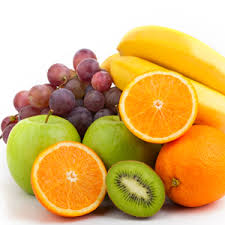
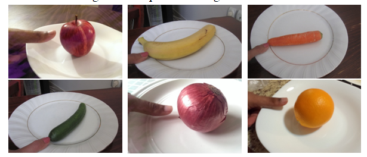
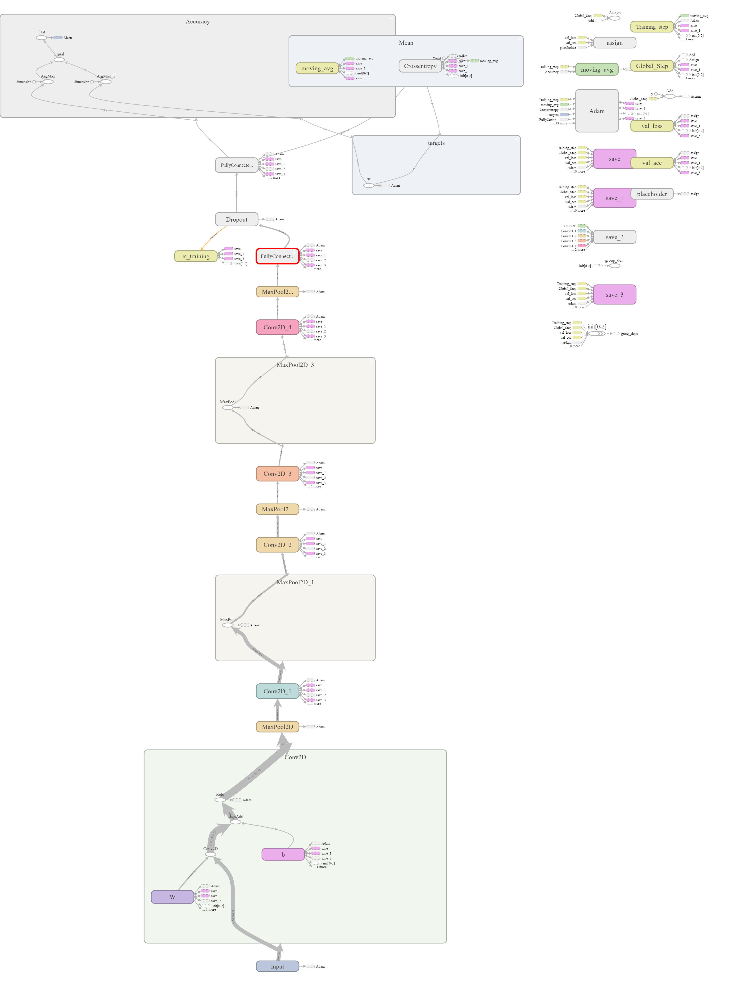
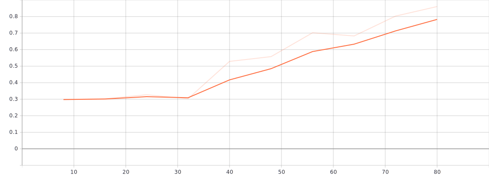
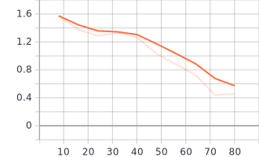

# Food Calories Estimation Using Image Processing


## [Vinayak Sable](https://www.linkedin.com/in/vinayak-sable-675502131) 

+ ###  Problem
 The problem can be simply stated as, given a set of food images with calibration object thumb with the food name and an unlabeled set of food images from the same group of food, identify food and estimate food volume and calories intake.
+ ### Objectives
 1.	To detect food type by using Convolutional Neural Network (CNN)
 2.	To estimate food weight and calories of food
 

+ ### Data collection
For this project I used two datasets:
1. [FOODD](https://drive.google.com/drive/folders/1rmVS_n6P1859trFxKhY7iHVywjTIRYwn?usp=sharing)
2. ECUST Food Dataset (ECUSTFD)

>In this project I used 7 food items like apple, banana, carrot, cucumber, onion, orange and tomato which details given in table below
  
  
## Food type

 | Fruits  | Density | Calorie| Label |	Shape   |
 | ------- | ------- | ------ | ----- | --------|
 | Apple   |  0.609  |   52   |   1   | Sphere  | 
 | Banana  |  0.94   |   89   |   2   | Cylinder|
 | Carrot  |  0.641  |   41   |   3   | Cylinder|
 | Cucumber|  0.641  |   16   |   4   | Cylinder|
 | Onion   |  0.513  |   40   |   5   | Sphere  |
 | Orange  |  0.482  |   47   |   6   | Sphere  |
 | Tomato  |  0.481  |   18   |   7   | Sphere  |


#### Sample food images in dataset:




### Recognition method
Food Recognition deals with recognition of food item when given an image. For this problem I used Convolutional Neural Network (CNN). The Architecture of  CNN given below figure 

> **all this work done in ```cnn.py``` file
change the directory to ```food-calories-estimation-using-Image-processing-master``` folder and give sufficient information to ```cnn.py``` python file and run**

#### Model representation


### Accuracy 


### Loss



### Requirements
+ Windows 10 Pro CPU 
+ Anaconda Distribution 4.6.11
+ Python
+ Tensorflow 
+ tflearn


### Testing
Google colab link for testing [click here](https://colab.research.google.com/drive/1dRVXXVfX5vQ0Re1kW_yX4zwJBNzSezoa?usp=sharing)
for testing our model run
```
python demo.py
```

### Training
Download data from above FOODD link and create forlder in repo FOODD and run
```
python train.py
```

### Estimation Method:
+ #### Image Segmentation:
A mixture of methods including canny edge detection, watershed segmentation, morphological operators and Otsu’s method were used to segment the food item to obtain the contour of the fruit and the contour of the thumb. We use the thumb finger for calibration purposes. The thumb is placed next to the dish while clicking the photo and this thumb gives us the estimate of the real-life size of the food item and helps estimate volume accurately.
> *all this done ```image_segment.py``` and ```calorie.py```*


## Result

 | Fruits  | Calorie | Estimated Calories|
 | ------- | ------- | -----------------| 
 | Apple   |  53.96  |   40.42          |
 | Banana  |  170.88 |   188.81         |  
 | Carrot  |  31.16  |   26.28          |
 | Cucumber|  29.44  |   37.65          |
 | Onion   |  44.88  |   37.13          |  
 | Orange  |  69.09  |   71.92          |
 | Tomato  |  17.46  |   13.82          |


### Limitation and Scope
+ #### Limitations:
    1.	Actual weight and calories can’t find due to image quality
    2.	Difficult to find appropriate angle between fruit And camera
    3. Lighting condition i.e pixel changes with respect to light
    
+ #### Scope:
    1.	Estimate the calorie from all types of fruits.
    2.	Minimize error of calories estimation
    
### Reference:
   1. P.Pouladzadeh, S.Shirmohammadi, and R.Almaghrabi, “Measuring Calorie and Nutrition from Food Image”, IEEE Transactions on Instrumentation & Measurement, Vol.63, No.8, p.p. 1947 – 1956, August 2014.

   2. Parisa Pouladzadeh, Abdulsalam Yassine, and Shervin Shirmohammadi, “Foodd: An image-based food detection dataset for calorie measurement,” in InternationalConferenceonMultimediaAssistedDietaryManagement, 2015

   3. Meghana M Reddy, “Calorie-estimation-from-food-images-opencv”, [Git repo](https://github.com/meghanamreddy/Calorie-estimation-from-food-images-OpenCV) , May 2016


<a href="mailto:vinayak.sable.56@gmail.com">@vinayak</a> What do you think about these ?
